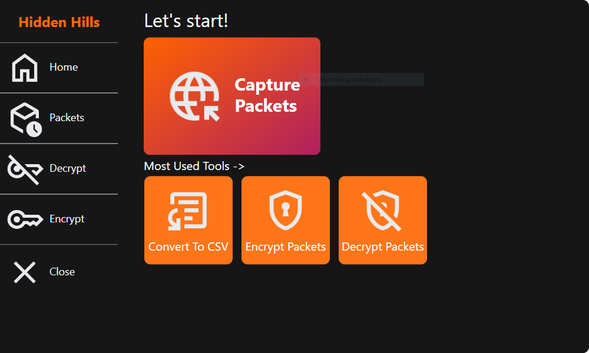
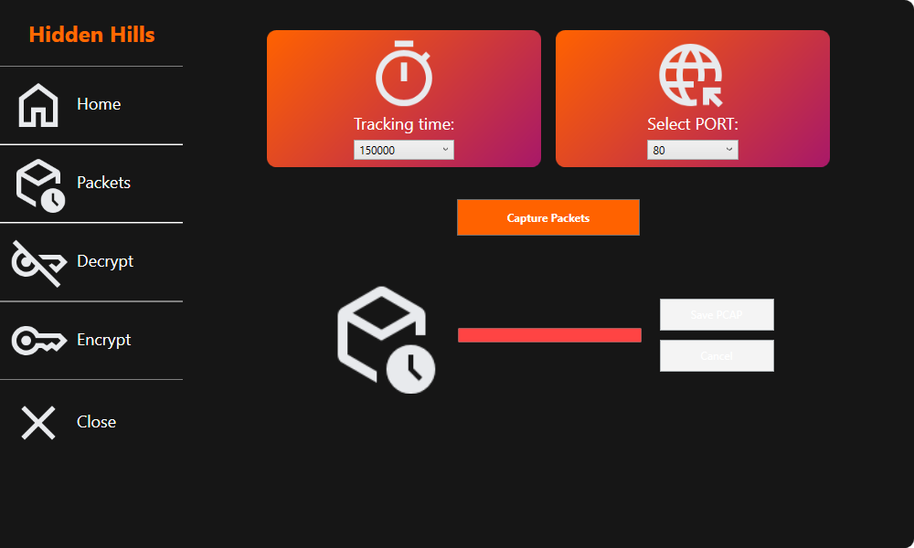
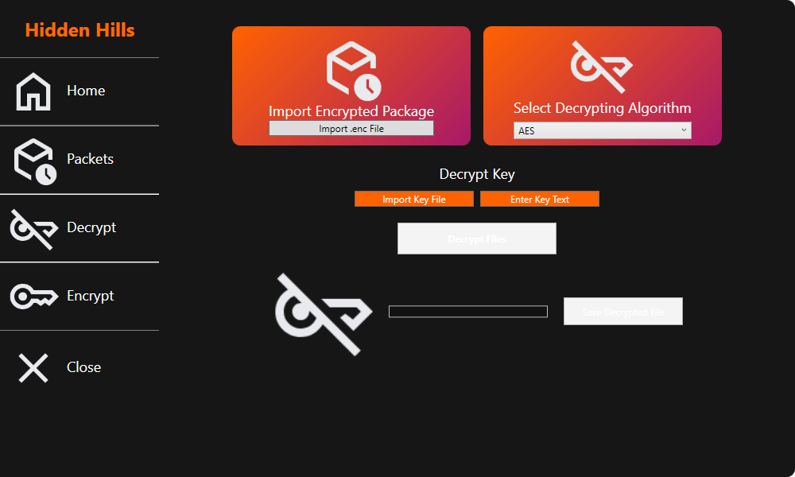
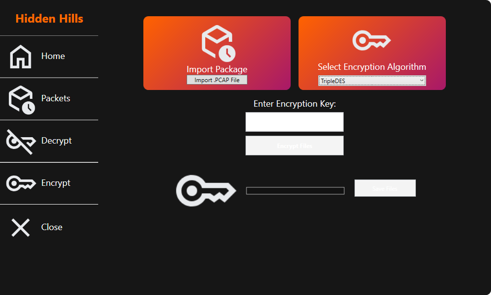

# Hidden Hills

Hidden Hills to desktopowa aplikacja kryptograficzna stworzona w technologii .NET (C#) z wykorzystaniem wzorca architektonicznego MVVM (Model–View–ViewModel). Aplikacja została zrealizowana jako projekt akademicki, mający na celu praktyczne zastosowanie mechanizmów szyfrowania oraz pracy z sieciowymi formatami pakietów.

## Funkcjonalności

- Szyfrowanie i odszyfrowywanie danych pakietowych zapisanych w formacie `.pcap`
- Importowanie plików PCAP oraz zapisywanie wyników do plików `.enc` i `.pcap`
- Wybór algorytmu szyfrującego (AES, DES, TripleDES)
- Importowanie zewnętrznych kluczy dekryptujących z pliku tekstowego
- Wprowadzanie klucza szyfrującego ręcznie
- Wizualizacja postępu operacji szyfrowania/dekryptowania
- Nasłuchiwanie portów przez określony czas

## Architektura projektu

- WPF (Windows Presentation Foundation) jako warstwa UI
- MVVM jako wzorzec organizacji kodu (rozdzielenie logiki od widoków)
- CommunityToolkit.MVVM – biblioteka ułatwiająca implementację powiadomień i komend
- Oddzielone widoki i modele widoków dla funkcjonalności szyfrowania i odszyfrowywania

Aplikacja jest modularna, czytelna i łatwa do rozbudowy o nowe algorytmy lub widoki.

## Obsługiwane algorytmy szyfrowania

- AES – bezpieczny standard szyfrowania danych (blok 128-bitowy)
- DES – klasyczny, ale słabszy algorytm 56-bitowy
- TripleDES – trzykrotne zastosowanie DES w celu zwiększenia bezpieczeństwa

Użytkownik może wybrać algorytm z listy oraz podać własny klucz tekstowy, który aplikacja dopasowuje długością do wymaganego rozmiaru.

## Format danych

- PCAP – format używany do zapisu pakietów sieciowych (np. TCP/UDP)
- .enc – format wyjściowy zaszyfrowanych danych

## Instrukcja instalacji

1. Sklonuj repozytorium:
git clone https://github.com/TaloHomes404/Hidden-Hills.git
2. Przejdź do folderu projektu:
cd Hidden-Hills
3. Otwórz rozwiązanie w Visual Studio:
- Otwórz plik `Hidden Hills.sln` w Visual Studio (wersja wspierająca .NET i WPF)
4. Zainstaluj zależności:
- Upewnij się, że masz zainstalowany .NET Desktop Development oraz pakiet CommunityToolkit.MVVM
5. Zainstaluj Npcap w wersji 64-bitowej (aplikacja wymaga go do obsługi PCAP i nasłuchu sieci)
6. Zbuduj i uruchom projekt (`F5` lub `Ctrl+F5`)

## Podsumowanie

Hidden Hills to kompleksowa aplikacja WPF o charakterze praktycznym i edukacyjnym – łącząca elementy przetwarzania pakietów sieciowych, kryptografii symetrycznej oraz nowoczesnej architektury MVVM w formie aplikacji desktopowej.

## Screenshots

